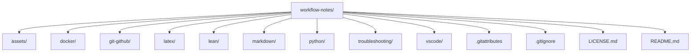

# Workflow Notes

A personal knowledge base documenting the development workflows, tools,
setups, commands, and problems I encounter while learning Python and
quantitative development.

These notes are primarily written as a reference for myself, but they are
public in the hope that they may also help others working through similar
problems.

This repository is continuously developed as I learn and build new projects.

---

## Git & GitHub

Notes covering Git, GitHub, repositories, version control, and everyday
development workflows.

| Git Note | Use this when... |
| --- | --- |
| [Local Git workflow](git-github/local-git.md) | Working locally: setup, commit, branch, merge, revert |
| [Create a `.gitignore`](git-github/gitignore-walkthrough.md) | Choosing files and folders Git should ignore |
| [Create a GitHub access token](git-github/github-access-token-walkthrough.md) | Authenticating Git with GitHub from your computer |
| [Connect a local repository to GitHub](git-github/connect-local-repo-to-github.md) | Linking an existing local repo to a GitHub repository |
| [Remove `.git` from a repository](git-github/remove-git-repo.md) | Removing Git tracking and turning a repo back into a normal folder |
| [Git commands: when and why](git-github/git-commands-usecase.md) | Understanding which Git command to use in different situations |
| [Git Bash cheatsheet](git-github/git-bash-cheatsheet.md) | Quickly looking up common terminal and Git Bash commands |
| [Writing a README](git-github/readme-guide.md) | Creating or improving a repository README |
| [Organising and moving files with Git](git-github/git-file-moves-and-staging.md) | Renaming, moving, deleting, and staging tracked files safely |

## Python

Notes covering Python environments, dependencies, and common setup tasks.

| Python Note | Use this when... |
| --- | --- |
| [How to create Virtual environment](python/venv-walkthrough.md) | Creating or activating a virtual environment for a project |
| [Removing a registered Jupyter kernel](python/remove-venv-registered-kernel.md) | Removing old notebook kernels that still appear in Jupyter |
| [Using `requirements.txt`](python/requirements.md) | Installing packages or recording project dependencies |

## Markdown

Notes covering Markdown syntax, formatting, links, tables, lists, and diagrams.

| Markdown Note | Use this when... |
| --- | --- |
| [Markdown tables](markdown/markdown-tables.md) | Organising information into rows and columns for easier reading |
| [Mermaid diagrams](markdown/markdown-mermaid-diagrams.md) | Creating flowcharts and visual diagrams directly inside Markdown |
| [Markdown links](markdown/markdown-links.md) | Creating clickable links to websites, files, headings, or other notes |
| [Markdown lists](markdown/markdown-lists.md) | Creating ordered, unordered, and nested lists |

## VS Code

Setup and workflow notes for Visual Studio Code.

| VS Code Note | Use this when... |
| --- | --- |
| [VS Code setup](vscode/vscode-setup.md) | Setting up VS Code for your development environment |
| [Markdown in VS Code](vscode/markdown-in-vscode.md) | Writing, previewing, and working with Markdown files inside VS Code |

## Docker

Notes covering Docker commands and local development workflows.

| Docker Note | Use this when... |
| --- | --- |
| [Docker commands](docker/docker-commands.md) | Looking up common Docker commands for containers, images, and local workflow tasks |

## QuantConnect LEAN

Notes covering my local QuantConnect LEAN development environment.

| LEAN Note | Use this when... |
| --- | --- |
| [LEAN local setup](lean/lean-local-setup.md) | Setting up LEAN locally on my computer |
| [Adding libraries to LEAN](lean/lean-library-add.md) | Installing or adding extra Python libraries to a LEAN project |

## LaTeX

Notes covering LaTeX setup and configuration on Windows.

| LaTeX Note | Use this when... |
| --- | --- |
| [LaTeX setup on Windows](latex/latex-setup-on-windows.md) | Setting up LaTeX tools and getting started with LaTeX on Windows |

## Troubleshooting

Solutions and explanations for problems I have encountered in my development environment.

| Troubleshooting Note | Use this when... |
| --- | --- |
| [OneDrive and Git conflict](troubleshooting/onedrive-gitconflict.md) | Git or project files are causing issues because of OneDrive syncing |
| [LF and CRLF line ending warning](troubleshooting/lf-crlf-warning.md) | Fixing or understanding Git line-ending warnings |

## Repository Structure

A quick visual overview of the main folders in this repository.

## License

This repository is licensed under the GNU General Public License v3.0.

You are free to use, modify, and redistribute the material in accordance with the terms of the license.

See the [LICENSE](LICENSE.md) file for full details.