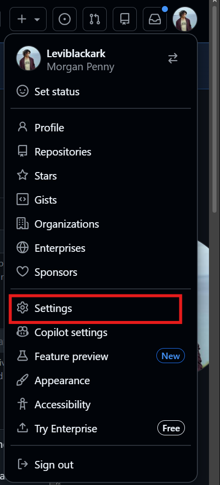
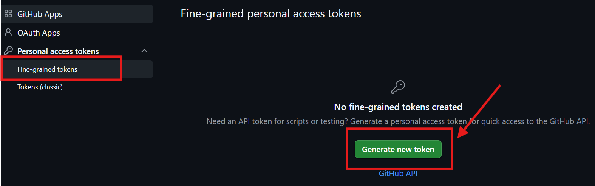
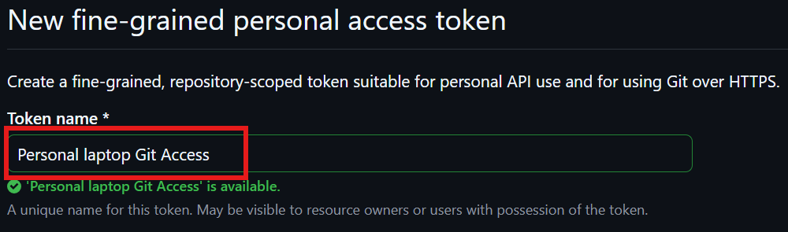
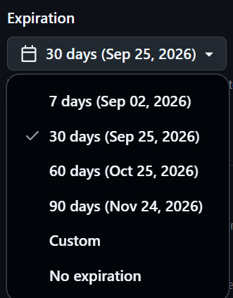

GitHub Personal Access Token

A **Personal Access Token (PAT)** is a credential that can be used to authenticate Git with GitHub.

For HTTPS Git operations, a token can be used instead of your GitHub account password.

> Treat a token like a password. Never save the actual token inside a Git repository, Markdown note, screenshot, or source-code file.

---

#### Why Is a Token Needed?

GitHub does not allow your normal GitHub password to be used for Git authentication over HTTPS.

For example:
```bash
git push
```
may need GitHub to verify:

Are you allowed to push to this repository?

Authentication can be handled using:
```text
Personal Access Token
        OR
Git Credential Manager
        OR
GitHub CLI
        OR
SSH
```

A token is therefore an authentication credential, not part of the repository itself.

---

#### Token Types

GitHub currently provides two types:
```text
Personal access tokens
│
├── Fine-grained tokens
│      └── Current recommended option
│
└── Tokens (classic)
       └── Older / broader permission system
```

#### Fine-grained Token

Can be restricted to:

* specific repositories
* specific permissions
* a particular expiration date

---

#### Existing / Expired Tokens

Go to:

```text
GitHub
  ↓
Profile picture
  ↓
Settings
  ↓
Developer settings
  ↓
Personal access tokens
```

You may see previously created tokens.

For example:
```text
fecapstone
Expired
Never used
```
An expired token can no longer authenticate.

If it is no longer needed:
```text
Expired token
     ↓
Delete
```

Deleting the token does not delete:
```text
repositories
commits
local files
Git history
```

It only `removes that authentication credential`.

---

#### Recommended Method — Fine-Grained Token
Step 1 — Open Settings

On GitHub:
```text
Profile picture
      ↓
Settings
```



--- 

#### Step 2 — Developer Settings

Scroll down the left sidebar and select:
```text
Developer settings
```


---

#### Step 3 — Personal Access Tokens

Select:
```text
Personal access tokens
      ↓
Fine-grained tokens
```

Then:

Generate new token
#### Step 3 - Tokens (classic)


---

#### Step 4 — Name the Token

Use a name describing what the token is for.

For example:
```text
Personal laptop Git access
```
or:
```text
Finance project Git access
```

Don't put the actual token value in the name.




---

#### Step 5 — Set an Expiration

Choose how long the token should remain valid.

For example:
```text
30 days
90 days
Custom date
```

Shorter expiration periods are safer.

Once the expiration date is reached:

```text
Token
  ↓
Automatically expires
  ↓
Can no longer authenticate
```
A new token can then be created when required.



---

Step 6 — Choose Repository Access

Fine-grained tokens allow control over which repositories they can access.

For example:

```text
Repository access

○ All repositories

● Only select repositories
```

For a token intended for one project, prefer:
```text
Only select repositories
        ↓
python-for-finance-project
```

This gives the token access only to the repository it needs.

---

#### Step 7 — Choose Permissions

Only give the token the permissions it actually requires.

For normal Git operations where you need to push changes, the important repository permission is generally:

```
Repository permissions
        ↓
Contents
        ↓
Read and write
```
Conceptually:
```
Read
 ↓
clone / pull / fetch

Write
 ↓
push changes
```

Avoid giving unrelated permissions unless the project actually needs them.

--- 

#### Step 8 — Generate the Token

Once the settings are correct:
```text
Generate token
```

GitHub will display the generated token.

It will look like a long random string.

For example:
```text
github_pat_xxxxxxxxxxxxxxxxxxxxxxxxx
```
> Never put a real token in documentation.

Copy the token when GitHub displays it.

The full token may not be shown again later.

---

#### Using the Token With Git

Personal access tokens are used with **HTTPS repositories**.

Check the remote:
```bash
git remote -v
```

An HTTPS remote looks like:
```
https://github.com/USERNAME/REPOSITORY.git
```

When Git asks for credentials:
```
Username:
```
enter your GitHub username.

When it asks:
```
Password:
```
enter the personal access token, not your GitHub password.

```
Git push
   ↓
GitHub asks for authentication
   ↓
Username
   ↓
PAT used instead of password
   ↓
GitHub checks permissions
   ↓
Push allowed
```

---
#### Sources 
Adding a local repository to GitHub using Git

> https://docs.github.com/en/migrations/importing-source-code/using-the-command-line-to-import-source-code/adding-locally-hosted-code-to-github?utm_source=chatgpt.com

Managing remote repos

> https://docs.github.com/en/get-started/git-basics/managing-remote-repositories
