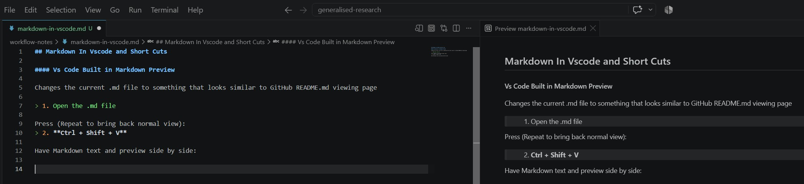
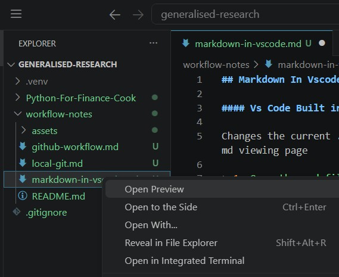

## Markdown In Vscode and Short Cuts

### Visualising Markdown

Changes the current .md file to something that looks similar to GitHub README.md viewing page <br>
**Method 1**
```text
1. Open the .md file 
```

Press (Repeat to bring back normal view):
```text
2. Ctrl + Shift + V
```

**Method 2**<br>
Have Markdown text and preview side by side:



Do it like this:

```text
1. Hold Ctrl and Press K
2. Release both Keys
3. Press V
```

**Method 3**<br>
You can also do this:

```text
1. Right-click inside the .md file and choose Open Preview. 
2. Drag and drop to the right side 
```



#### Resources

Github Web-link for Formatting:

> https://docs.github.com/en/get-started/writing-on-github/getting-started-with-writing-and-formatting-on-github/basic-writing-and-formatting-syntax