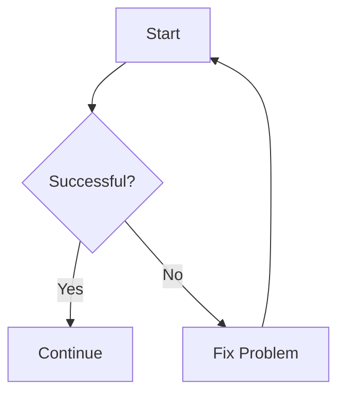

> [BACK](../README.md)

# Markdown Lists

Markdown lists are used to organise information into:

- bullet points
- numbered steps
- nested items
- checklists

They are useful for notes, instructions, workflows, requirements, and quick-reference information.

---

## Unordered Lists

Use `-`, `*`, or `+` to create bullet points.

The most common choice is `-`.

```markdown
- First item
- Second item
- Third item
```

This renders as:

- First item
- Second item
- Third item

### Recommended Style

For consistency, use:

```text
-
```

for normal bullet lists.

---

## Ordered Lists

Use numbers followed by a full stop.

```markdown
1. First step
2. Second step
3. Third step
```

This renders as:

1. First step
2. Second step
3. Third step

Ordered lists are useful when the **order matters**, such as:

- setup instructions
- workflows
- procedures
- tutorials

---

## Nested Lists

Lists can contain other lists.

Indent the nested item underneath the parent item.

```markdown
- Programming
    - Python
    - SQL
    - R
- Tools
    - Git
    - VS Code
```

This renders as:

- Programming
    - Python
    - SQL
    - R
- Tools
    - Git
    - VS Code

Nested lists are useful for showing **categories and subcategories**.

---

## Nested Numbered Lists

Numbered lists can also contain sub-steps.

```markdown
1. Create the project
    1. Create the folder
    2. Open the folder
2. Initialise Git
3. Make the first commit
```

This is useful when one main step contains several smaller steps.

---

## Mixing List Types

You can mix numbered and bullet lists.

```markdown
1. Create the project
    - Create the folder
    - Create the README
    - Create the `.gitignore`
2. Initialise Git
3. Commit the files
```

This is useful when you have:

```text
main step
    ↓
several details
```

---

## Task Lists

Markdown can also create checkboxes.

### Incomplete Task

```markdown
- [ ] Finish documentation
```

### Completed Task

```markdown
- [x] Create repository
```

Example:

```markdown
- [x] Create repository
- [x] Add README
- [ ] Finish notes
- [ ] Push to GitHub
```

This renders as:

- [x] Create repository
- [x] Add README
- [ ] Finish notes
- [ ] Push to GitHub

Task lists are useful for:

- project planning
- study progress
- setup checklists
- GitHub issues
- personal workflows

---

## Adding Formatting Inside Lists

Normal Markdown formatting can be used inside list items.

### Bold

```markdown
- **Important:** check the result
```

### Italics

```markdown
- *Optional:* add another example
```

### Inline Code

```markdown
- Run `git status`
- Open `README.md`
```

Example:

- Run `git status`
- Open `README.md`

---

## Adding Code Under a List Item

Code can be placed underneath a list item.

```markdown
1. Check the Git status:

    ```bash
    git status
    ```

2. Stage the files:

    ```bash
    git add .
    ```
```

Indent the code block so Markdown understands that it belongs to the list item.

---

## Adding Notes Under a List Item

You can also add extra text below an item.

```markdown
1. Run the command.

    This checks the current state of the repository.

2. Review the output.
```

This is useful for instructions where each step needs an explanation.

---

## Lists vs Tables

Use a **list** when information follows a sequence or is simply a collection.

Example:

```markdown
- Python
- SQL
- Git
```

Use a **table** when every item has the same categories.

Example:

```markdown
| Tool | Purpose |
|---|---|
| Python | Programming |
| SQL | Querying data |
| Git | Version control |
```

A simple rule:

> Use lists for steps and collections.  
> Use tables for comparisons and structured reference information.

---

## Lists vs Mermaid

Use a list when you simply need to show:

```text
Step 1
Step 2
Step 3
```

Use Mermaid when the process has:

- different paths
- decisions
- loops
- relationships

For example:



---

## Quick Reference

| Syntax | Purpose |
|---|---|
| `- Item` | Bullet point |
| `1. Item` | Numbered item |
| `    - Item` | Nested bullet |
| `    1. Item` | Nested numbered step |
| `- [ ] Task` | Incomplete task |
| `- [x] Task` | Completed task |
| `` `code` `` | Inline code inside a list |

---

## Basic Templates

### Bullet List

```markdown
- Item
- Item
- Item
```

### Numbered Steps

```markdown
1. Step
2. Step
3. Step
```

### Checklist

```markdown
- [ ] Task
- [ ] Task
- [x] Completed task
```

### Nested List

```markdown
- Main item
    - Sub-item
    - Sub-item
- Main item
```

---

## Tips

- Use bullet lists when order does not matter.
- Use numbered lists when order matters.
- Use nested lists to show hierarchy.
- Use checkboxes for tasks and progress.
- Avoid nesting lists too deeply.
- Keep each item short where possible.
- Use tables instead when you are comparing the same properties across several items.

---
> [BACK](../README.md) 😮 [TOP](#markdown-lists)