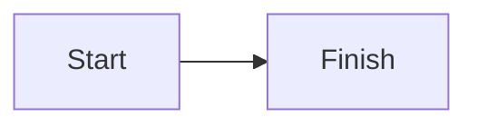
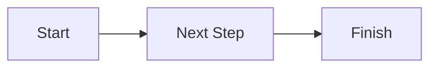
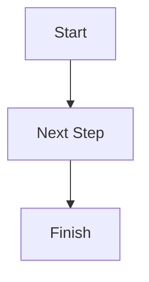
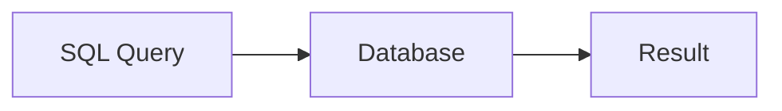
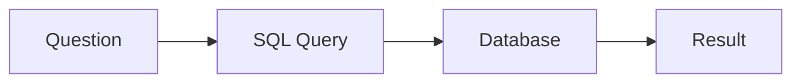
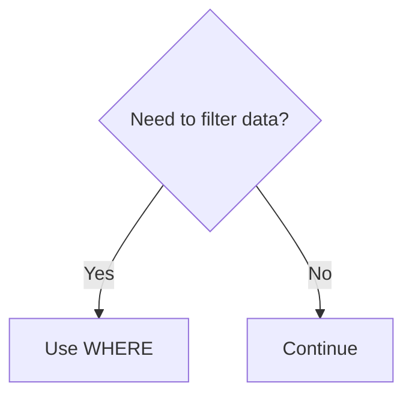
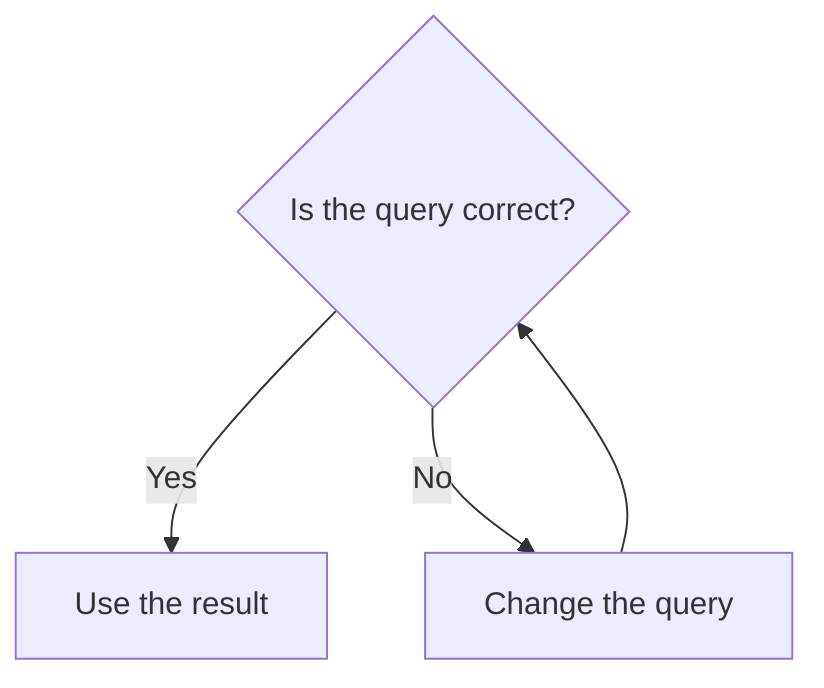
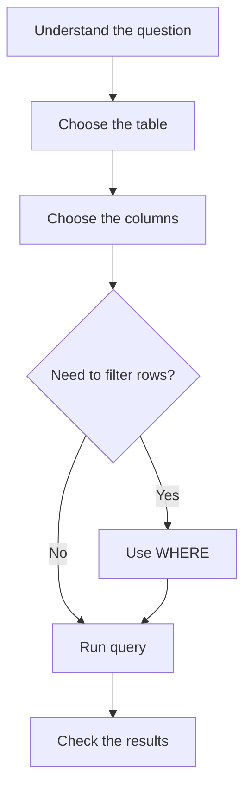
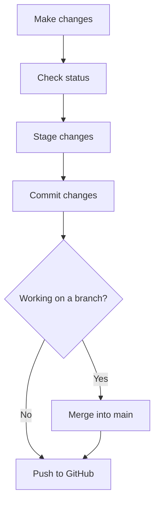

> [BACK](../README.md)

# Mermaid Diagrams in Markdown

Mermaid allows you to create **flowcharts and diagrams using text** inside Markdown files.

Instead of manually drawing a diagram, you describe the structure using Mermaid syntax and a supported Markdown viewer renders it visually.

---

## Basic Syntax

Create a fenced code block and use `mermaid` as the language:

```text

```

When rendered, this creates:

**Start → Finish**

> GitHub supports Mermaid diagrams directly inside Markdown files.

---

## Flowchart Direction

The direction is written after `flowchart`.

### Left to Right



```text
flowchart LR
```

`LR` = **Left to Right**

### Top to Bottom



```text
flowchart TD
```

`TD` = **Top Down**

---

## Creating Nodes

Each item in the diagram is given an ID.

```text
A[Start]
B[Database]
C[Result]
```

- `A`, `B`, `C` are IDs used by Mermaid.
- The text inside the brackets is what appears in the diagram.

Example:



---

## Connecting Nodes

Use:

```text
-->
```

to create an arrow.

```text
A --> B
```

Example:



---

## Common Shapes

### Rectangle

```text
A[Process]
```

Useful for normal steps.

### Rounded Box

```text
A(Process)
```

Useful for starts, finishes, or general steps.

### Decision

```text
A{Question?}
```

Creates a diamond shape and is useful when there are different possible paths.

Example:



---

## Labelled Arrows

You can add text to an arrow:

```text
A -->|Yes| B
A -->|No| C
```

Example:



---

## Example: SQL Workflow



This is written as:

```text
flowchart TD
    A[Understand the question] --> B[Choose the table]
    B --> C[Choose the columns]
    C --> D{Need to filter rows?}

    D -->|Yes| E[Use WHERE]
    D -->|No| F[Run query]

    E --> F
    F --> G[Check the results]
```

---

## Quick Reference

| Syntax | Meaning |
|---|---|
| `flowchart LR` | Left-to-right flowchart |
| `flowchart TD` | Top-to-bottom flowchart |
| `A[Text]` | Rectangle |
| `A(Text)` | Rounded box |
| `A{Text}` | Decision / diamond |
| `A --> B` | Arrow from A to B |
| `A -->|Yes| B` | Labelled arrow |

---

## Previewing Mermaid

In VS Code, the Markdown editor may show the Mermaid **code** rather than the finished diagram.

Open the **Markdown Preview** to see how the file renders.

Useful VS Code shortcut:

```text
Ctrl + Shift + V
```

GitHub can also render Mermaid diagrams when they are placed inside `.md` files.

---

## When Mermaid Is Useful

Mermaid is useful for visually explaining:

- workflows
- decision processes
- program logic
- database structure
- SQL query thinking
- Git workflows
- project processes

Use diagrams when they make a concept easier to understand rather than adding one to every section.

---

## Example: Git Workflow

Mermaid can also be used to visualise a Git workflow.



The flow represents:

```text
Make changes
    ↓
git status
    ↓
git add
    ↓
git commit
    ↓
merge branch if needed
    ↓
git push
```

### Example Commands

```bash
git status
git add .
git commit -m "Update notes"
git switch main
git merge branch-name
git push
```

> The diagram shows the overall process, while the commands show how you would carry it out in Git.

---

> [BACK](../README.md) 😮 [TOP](#mermaid-diagrams-in-markdown)
