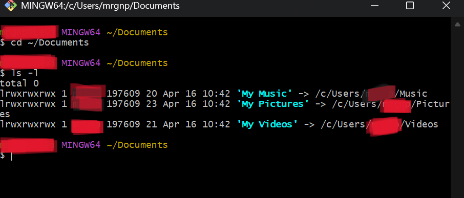
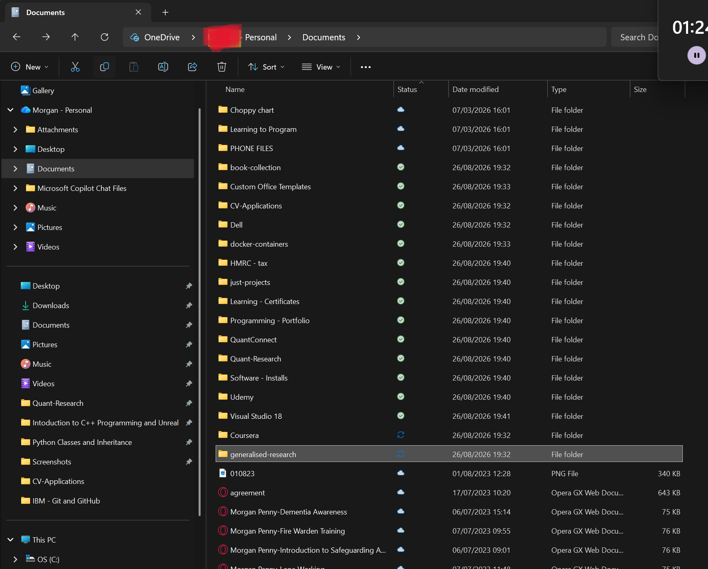
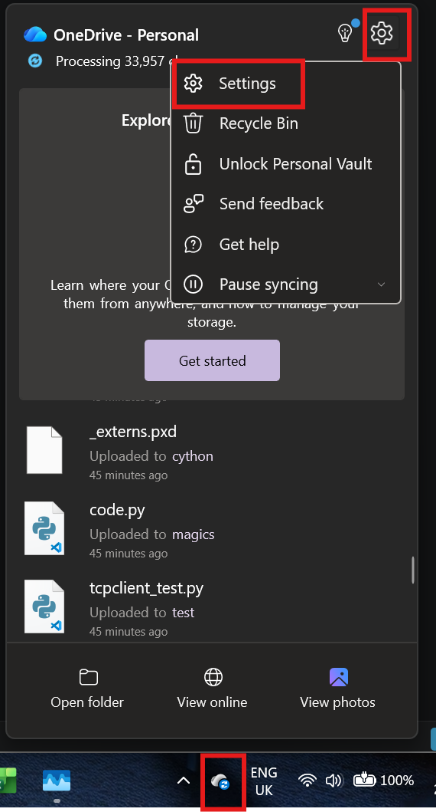
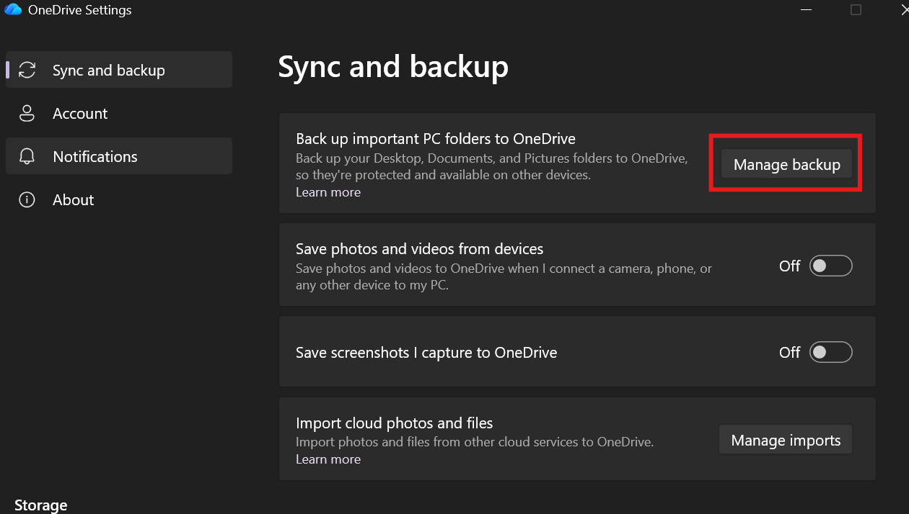
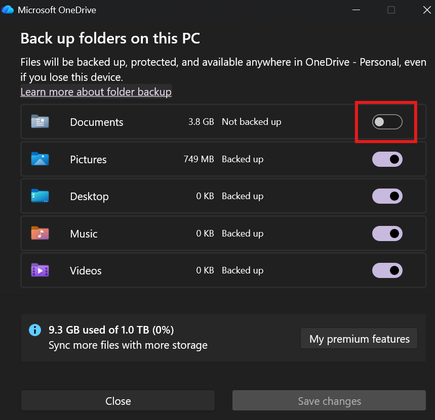
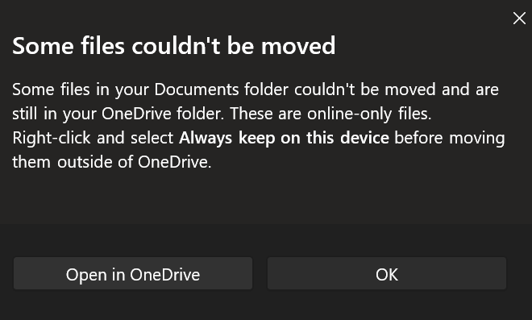

#### Fixing OneDrive Documents Folder Redirection on Windows

Git bash messed when Onedrive started backing up:



At the top the file path has changed after backup compeleted:



#### What happened

OneDrive can enable a feature called **folder backup** for Windows folders such as:

* Documents
* Desktop
* Pictures

When this happens, Windows can change the location of your Documents folder from:
```text
C:\Users\<username>\Documents
```

to something similar to:
```text
C:\Users\<username>\OneDrive\Documents
```

This can make File Explorer, VS Code, Git Bash, Jupyter, and other programs appear to be looking at different folders.

For example:

File Explorer
```text
→ C:\Users\<username>\OneDrive\Documents
```

Git Bash
```text
→ C:\Users\<username>\Documents
```

The files normally have not been deleted. Windows is simply treating the `OneDrive folder as the main Documents folder`.

---

#### Important: Do not manually move files yet

Before changing anything:

Do not:

* drag all the files back manually
* delete the OneDrive copy
* delete the local Documents folder
* move programming projects while OneDrive is still syncing

> Doing this while OneDrive is active can create duplicates or accidentally remove synced files.

---

#### Step 1 — Let OneDrive finish syncing

Find the **OneDrive cloud icon** near the Windows clock. Bottom right of the taskbar.

Click it.
```text
Check its status.
```

Ideally it should say:
```text
Up to date
```
If it says:
```text
Syncing
```

`let it finish first`

---

#### Step 2 — Make important files available locally

Inside:
```text
OneDrive > Documents
```

look at the icons beside your files and folders.
```text
Cloud icon ☁️
```

The file may only exist online.
```text
Green tick ✅
```

The file is available locally on the computer.
```text
Circular arrows 🔄
```

The file is currently syncing.

For important files or folders:
```text
Right-click them.
Select:
Always keep on this device
Wait until they show green ticks.
```

For example:
```text
QuantConnect                 ✅
Quant-Research               ✅
Programming Projects         ✅
Course Work                  ✅
Important Documents          ✅
```

This ensures there is a physical copy on the PC before stopping OneDrive backup.

---

#### Step 3 — Open OneDrive backup settings

Click:

1. OneDrive cloud icon

Then:

2. Settings


Then:

3. Sync and backup

Then:

4. Manage backup



You may see:
```text
Desktop       Backed up
Documents     Backed up
Pictures      Backed up
```


---

Step 4 — Stop Documents backup

Find:
```text
Documents
```
and `choose to stop its backup`.

If OneDrive asks where the files should remain, choose:
```text
Keep files on my PC
```

Do not choose:
```text
Keep files only in OneDrive
```

if the goal is to restore the normal local Documents folder.

---

#### Step 5 — If OneDrive says files must be downloaded first



You may receive a message such as:
```text
Some files couldn't be moved.
```

or:
```text
Download the files first.
```

This means some files are still cloud-only.

* Do not manually move them.

Instead:

1. Click Open in OneDrive.
2. Open the OneDrive Documents folder.
3. Select the affected files or folders.
4. Right-click.
5. Select: <br>
Always keep on this device 
6. Wait for the green ticks.
7. Return to: <br>

OneDrive Settings
```text
→ Sync and backup
→ Manage backup
```
8. Stop Documents backup again.

---

#### Why turning OneDrive backup off restores the path

Windows has special folders called Known Folders, including:
```text
Documents
Desktop
Pictures
```

Normally Documents points to:
```text
C:\Users\<username>\Documents
```

When OneDrive Documents Backup is enabled, OneDrive changes the Windows Documents location to:

```text
C:\Users\<username>\OneDrive\Documents
```
Programs asking Windows for the Documents folder may therefore receive the OneDrive path.

When OneDrive Documents Backup is stopped and the files are kept on the PC, Windows restores the normal location:

```text
C:\Users\<username>\Documents
```