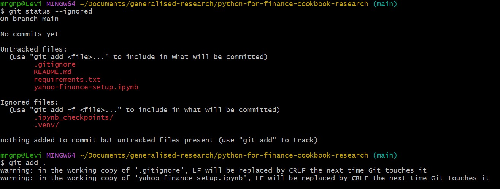

### I ran in to a issue when running `git add .`



```text
warning: in the working copy of '.gitignore', LF will be replaced by CRLF the next time Git touches it

warning: in the working copy of 'yahoo-finance-setup.ipynb', LF will be replaced by CRLF the next time Git touches it
```

---

The first important correction is that an “`LF file`” and a “`CRLF file`” are not different kinds of files. They are ordinary text files that use different invisible characters to represent the end of a line.

#### What LF and CRLF actually are

Imagine you type this in VS Code:
```text
Hello
World
```
You visually see:
```text
Hello
World
```
but internally the computer needs something to say:

> “The word Hello ends here. Start a new line.”

Historically, operating systems chose different invisible characters.

Linux/macOS generally use:
```text
Hello[LF]World
```

LF means Line Feed and is represented as:
```text
\n
```

Windows traditionally uses two characters:
```text
Hello[CR][LF]World
```

which is:
```text
\r\n
```
CR means Carriage Return and LF means Line Feed.

So:
```text
LF
= \n
= one line-ending character
```

whereas:
```text
CRLF
= \r\n
= two line-ending characters
```
You normally never see them because VS Code hides them.

So these two files look identical:

```text
Hello
World
```

but internally they could be:

#### LF version
```text
Hello\nWorld
```
or:

#### CRLF version
```text
Hello\r\nWorld
```
That's all we're talking about.

---

#### Why does Windows cause this Git issue?

Because you're using Windows, but Git was originally designed around Unix-style development where `LF` is normal.

Git therefore has features that help Windows users work with repositories containing LF text.

There are really three places to think about:
```text
Your working folder
       ↓
Git staging area
       ↓
Git repository/history
```

More accurately:
```text
WORKING TREE
The files you actually see/edit in VS Code

        ↓ git add

INDEX / STAGING AREA
What Git is preparing for the next commit

        ↓ git commit

REPOSITORY
The committed history inside .git
```

Git can change line endings while content moves between these places.

That's the bit that makes the warning confusing.

---

#### What `core.autocrlf=true` means

You ran:

```bash
git config --show-origin --get core.autocrlf
```

Let's split that apart.
```bash
git config
```

means:

> Show or change Git configuration.

Then:
```bash
--get core.autocrlf
```
means:

> Tell me the current value of the core.autocrlf setting.

And:
```bash
--show-origin
```

So you might get:

```bash
file:C:/Users/your-name/.gitconfig    true
```
That tells you two things:
```text
Setting:
core.autocrlf = true

Location:
your global Git configuration
```
The `--show-origin` part is particularly useful because Git settings can exist at several levels:
```text
System Git config
        ↓
Global user config
        ↓
Repository-specific config
```
If Git behaves strangely, --show-origin helps answer:

> “Where did this setting actually come from?”

---

#### What does true actually do?

With:
```bash
core.autocrlf=true
```
Git essentially tries to behave like this:

```text
WINDOWS WORKING FILE
CRLF
  ↓
git add
  ↓
Git normalises text
  ↓
LF stored by Git
```

Then when Git creates the file in your Windows working folder:

```text
Git repository
LF
  ↓
checkout
  ↓
Windows working folder
CRLF
```

So conceptually:
```text
             git add
CRLF working file ───────→ LF in Git

             checkout
LF in Git ───────────────→ CRLF working file
```
That is what `core.autocrlf=true` is trying to automate.

---

#### So what did your warning mean?

```text
warning: in the working copy of '.gitignore',
LF will be replaced by CRLF the next time Git touches it
```

The `.gitignore` currently contains:

```text
LF
```

Git looked at your configuration:
```bash
core.autocrlf=true
```
and effectively said:

```text
“This file currently uses LF. Because you're configured for Windows CRLF working files, if I recreate this file later I may write it back using CRLF.”
```

It is not saying the file is damaged.

It's more like:

```text
Current working file:
LF

Git configuration expects:
CRLF in Windows working tree

Therefore:
I'm warning you that this may change later.
```

---

Why does Git care?

Because without consistent line endings, Git can sometimes think an entire file changed when really only the invisible newline characters changed.

Imagine:
```text
Original:

Hello\n
World\n
```

and later:
```text
Hello\r\n
World\r\n
```

To you:

```text
Hello
World
```

looks identical.

But byte-for-byte, every line is technically different.

In a bad setup Git might produce a huge diff:
```text
- Hello
- World

+ Hello
+ World
```
even though you didn't actually change the words.

That's one reason line-ending normalisation exists.

----

#### This is where .gitattributes comes in

`.gitattributes` lets the repository itself declare how Git should handle files.

That's different from:
```text
core.autocrlf
```

because `core.autocrlf` is configuration on your computer.

Think:

```text
core.autocrlf
        ↓
"My Git installation should behave this way."


.gitattributes
        ↓
"This particular repository should treat
its files this way."
```

That makes `.gitattributes` useful for shared and portfolio projects.

Someone can clone your repo on:
```text
Windows
Linux
macOS
```

and the repository still carries its line-ending rules.

---

#### `.gitignore` versus `.gitattributes`

```text
.gitignore
    ↓
Which files should Git NOT track?


.gitattributes
    ↓
How should Git HANDLE files it DOES track?
```

They solve completely different problems.

---

#### A sensible `.gitattributes` for your projects

```text
* text=auto

*.py text eol=lf
*.md text eol=lf
*.txt text eol=lf
*.json text eol=lf
*.ipynb text eol=lf

.gitignore text eol=lf
.gitattributes text eol=lf
```

Let's break it down.

This:
```text
* text=auto
```

means:

> Git, automatically determine which files are text files and normalise text where appropriate.

The `*` means:
```text
all files
```

Then:
```text
*.py text eol=lf
```

means:

> Every .py file is text, and I want LF line endings.

Likewise:
```text
*.md text eol=lf
```

means Markdown files should use LF.

And:
```text
*.ipynb text eol=lf
```

means Jupyter notebooks — which are really JSON text files internally — should use LF.

---

#### Why LF instead of CRLF?

Even though you're on Windows, modern tools such as:
```text
VS Code
Python
Git
Jupyter
GitHub
Docker
```

are perfectly happy with LF.

And if you work with things such as:
```text
Docker
Linux
servers
GitHub Actions
shell scripts
```

LF tends to make cross-platform development simpler.

So your Windows machine can happily contain:
```text
README.md    → LF
script.py    → LF
notes.md     → LF
```

There's nothing wrong with that.

---

#### Now the confusing command: `git add --renormalize` .

This one makes much more sense once you understand the staging area.

Suppose you already have a repository with committed/tracked files:

```text
project/
├── README.md
├── analysis.py
└── notebook.ipynb
```

They were previously handled according to whatever Git rules existed at the time.

Then today you create:
```text
.gitattributes
```
with:
```text
*.py text eol=lf
*.md text eol=lf
*.ipynb text eol=lf
```

Git now has new rules.

But Git doesn't necessarily go backwards and automatically re-process every previously tracked file.

That's where:
```bash
git add --renormalize .
```

comes in.

It essentially means:

> “Git, take the files you're already tracking and run them through the current .gitattributes normalisation rules again. Stage any resulting changes.”

So:
```text
Existing tracked files
        ↓
new .gitattributes rules
        ↓
git add --renormalize .
        ↓
Git checks them again
        ↓
Normalised representation placed in staging area
```
The word:
```text
re-normalize
```
literally means:

> Apply the normalisation rules again.

---

#### Why do we first run git add .gitattributes?

You might do:
```bash
git add .gitattributes
```

That simply stages the new rules file itself.

So staging becomes:

```text
Staging area

new file: .gitattributes
```

Then:
```bash
git add --renormalize .
```

re-processes the existing tracked files according to the new rules.

Then:
```bash
git status
```
lets you inspect what Git intends to commit.

Finally:
```bash
git commit -m "Add line ending configuration"
```

records the change `permanently`.

The sequence is:
```text
Create .gitattributes
        ↓
git add .gitattributes
        ↓
Stage the new repository rules
        ↓
git add --renormalize .
        ↓
Reprocess existing tracked files
        ↓
git status
        ↓
Review everything
        ↓
git commit
```

---

#### Why commit afterwards?

Because remember:
```bash
git add
```

does not save something into Git history.

It only says:

> Put this version into the staging area for my next commit.

So:

```text
Working files
       ↓
git add
       ↓
Staging area
       ↓
git commit
       ↓
Git history
```

Therefore:

```bash
git add .gitattributes
git add --renormalize .
```
has prepared the changes.

Then:
```bash
git commit -m "Configure repository line endings"
```

actually records them.

---

##### Is `--renormalize` needed for every new repository?

No.

This is the really important distinction.

Fresh repository

Imagine you've just created:

```
my-project/
├── README.md
├── main.py
├── .gitignore
└── .gitattributes
```
and haven't added anything to Git yet.

You do:
```bash
git init
```
Then:
```bash
git add .
```
Git sees .gitattributes and applies those rules the first time the files enter the staging area.

So:
```text
Fresh repo
    ↓
Create .gitattributes first
    ↓
git add .
    ↓
Rules are applied immediately
```
No:
```text
git add --renormalize .
```
is normally necessary.

---

#### Existing repository is different

Suppose this happened:
```text
git init
    ↓
git add .
    ↓
git commit
```
and then later you realise:

“I should add .gitattributes.”

Now you already have files tracked using the previous behaviour.

So:
```bash
Existing repo
     ↓
Create .gitattributes
     ↓
git add .gitattributes
     ↓
git add --renormalize .
     ↓
git status
     ↓
git commit
```
That's when `--renormalize` is particularly useful.

---

## Repo with stuff in it already

That's why your current situation is slightly different.

You've already done:
```bash
git init
git add .
```

and you've encountered:

```text
LF will be replaced by CRLF
```

So if you now decide to introduce .gitattributes, you're introducing the policy after Git has already started processing files.

I would do:
```bash
git config --show-origin --get core.autocrlf
```

Understand what your machine is configured to do.

Then create:
```text
.gitattributes
```
with something like:
```text
* text=auto

*.py text eol=lf
*.md text eol=lf
*.txt text eol=lf
*.json text eol=lf
*.ipynb text eol=lf

.gitignore text eol=lf
.gitattributes text eol=lf
```
Then:
```bash
git add .gitattributes
```
followed by:
```bash
git add --renormalize .
```

then:
```bash
git status
```
and finally, once you're happy:
```bash
git commit -m "Configure line endings"
```

---

## Creating a Repo from the start

Make these before your first `git add .`:
```text
project/
│
├── .gitignore
├── .gitattributes
├── README.md
├── requirements.txt
└── code...
```

Then:
```bash
git init
```

Check:
```bash
git status
```

Then:
```bash
git add .
```

Then:
```bash
git status
```

Then:
```bash
git commit -m "Initial project setup"
```

So your future workflow becomes:

```text
Create project
      ↓
Create .gitignore
      ↓
Create .gitattributes
      ↓
git init
      ↓
git status
      ↓
git add .
      ↓
git status
      ↓
git commit
```

Much cleaner.

---

```text
Fresh repository
----------------
Create .gitattributes BEFORE first git add
→ normalisation happens automatically


Existing repository
-------------------
Add/change .gitattributes
→ git add --renormalize .
→ reapply the new rules to tracked files
```

our warning, translated into normal English

When you see:

```text
LF will be replaced by CRLF the next time Git touches it
```

translate it mentally to:

> “This text file currently uses Unix-style line endings, but my Windows Git configuration is configured to use Windows-style line endings in the working folder.”

That's all it means.

It has nothing to do with Git failing to track the file, and it doesn't mean your Python/Jupyter/Markdown file is corrupted.
